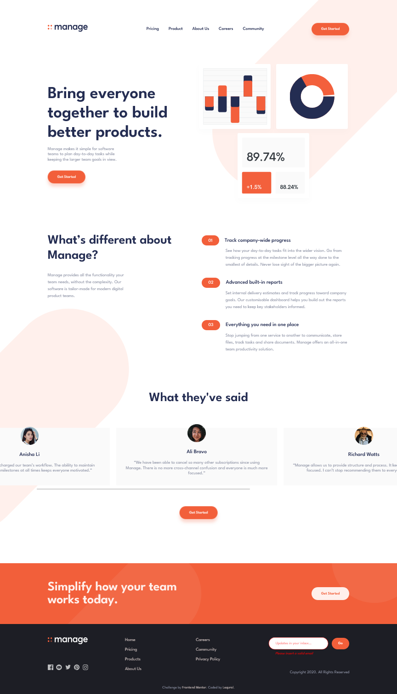
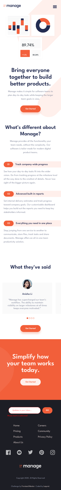

# Frontend Mentor - Manage landing page solution

This is a solution to the [Manage landing page challenge on Frontend Mentor](https://www.frontendmentor.io/challenges/manage-landing-page-SLXqC6P5).

## Table of contents

- [Overview](#overview)
  - [The challenge](#the-challenge)
  - [Screenshot](#screenshot)
  - [Links](#links)
- [My process](#my-process)
  - [Built with](#built-with)
  - [What I learned](#what-i-learned)
  - [Continued development](#continued-development)
  - [Useful resources](#useful-resources)
- [Author](#author)
- [Acknowledgments](#acknowledgments)

## Overview

### The challenge

Users should be able to:

- View the optimal layout for the site depending on their device's screen size
- See hover states for all interactive elements on the page
- See all testimonials in a horizontal slider
- Receive an error message when the newsletter sign up `form` is submitted if:
  - The `input` field is empty
  - The email address is not formatted correctly

### Screenshot

### Links

- [Solution URL repo](https://github.com/Lequral/Manage-Landing-Page)
- [Live Site URL](https://lequral.github.io/Manage-Landing-Page/)
- [Frontend Mentor Solution]()

## My process

### Built with

- Flexbox
- Desktop-first workflow
- [SvelteKit](https://kit.svelte.dev/) - Svelte Framework
- Scss
- Typescript

### Continued development

In the future, I will review Svelte's tuto to make sure I take full advantages of the framework on my next web page.

## Author

- Github - [Lequral](https://github.com/Lequral)
- Frontend Mentor - [@Lequral](https://www.frontendmentor.io/profile/Lequral)

## Acknowledgments

I'd like to compliment myself on the consistency of my work and the motivation I've shown throughout the conception of this project.